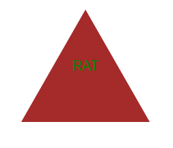

# Ye OLde SVG Maker

## Description
Ye Olde SVG Maker is a Node.js command-line application that allows users to create simple SVG logos based on their input choices. Users can select a shape, set colors for both the text and the shape, and input a short text label to generate custom SVG files efficiently and quickly.

## Table of Contents
- [Installation](#installation)
- [Screenshots](#screenshots)
- [Usage](#usage)
- [License](#license)
- [Contributing](#contributing)
- [Tests](#tests)
- [Questions](#questions)

## Installation
1. Clone the repository:https://github.com/AaronBringhurst/Ye-Old-SVG-Generator

2. Install dependencies:
npm install

3. Start the server:
npm start

## Screenshots

Here are some screenshots from the project:

### Cat

### Dog

### Rat

### Running Application

## Usage
To use Ye Olde SVG Maker, run the following command in the terminal: node index.js Follow the prompts to select your logo's shape, set the colors, and input your text. The SVG file will be generated in the 'dist' directory as 'logo.svg'.

## License
This project is licensed under the ## License
This project is licensed under the [MIT License](https://opensource.org/licenses/MIT).

 license.

## Contributing
Contributions to the Ye Olde SVG Maker are welcome! Here's how you can contribute:

1. Fork the repository
2. Create a new branch (`git checkout -b feature/AmazingFeature`)
3. Commit your changes (`git commit -m 'Add some AmazingFeature'`)
4. Push to the branch (`git push origin feature/AmazingFeature`)
5. Open a Pull Request

## Tests
To run tests, navigate to the project directory and run: npm test This will execute the Jest test suites defined for the shape classes.

## Questions
If you have any questions about the project, feel free to reach out:

- GitHub: [Aaron Bringhurst](https://github.com/AaronBringhurst)
- Email: bringhurst.aaron@gmail.com